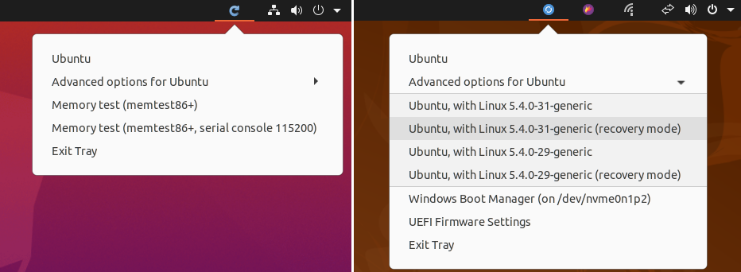

# Grub Reboot Picker  

This utility is an app indicator (tray icon) to help you reboot into other OSes.  
Instead of picking the OS you want at the grub menu, you can just preselect it from the menu here.  
Basically it's a wrapper around `grub-reboot`. I've only tested this on Ubuntu 20.04. 

 

## Install it

Get the latst `.deb` from Releases and install it. 

```
wget https://github.com/mendhak/grub-reboot-picker/releases/latest/download/grub-reboot-picker.deb
sudo apt install ./grub-reboot-picker.deb
```

## Run it

The application will auto start the next time you log in to Ubuntu.  
You can also launch it directly by searching for `Grub Reboot Picker` in Activities


## Use it

Click on the application icon.  
A menu with grub entries will appear.  
Click one of the entries.  
After a moment, Ubuntu will reboot.  
The grub menu item you chose should be preselected. 


# TODO

Configuration file or Configuration screen: 
* Top level or double level menu items
* Nicknames for menu items  

Run a single instance of the application

Determine if LaunchPad PPA is feasible, to get automatic updates. 
Or [hosting an apt repository on Github Pages](https://pmateusz.github.io/linux/2017/06/30/linux-secure-apt-repository.html)

Don't hardcode the current version number, get it from tag name or env variable

Sign the .deb if possible  

# Developing locally

## Running it from this repo

You can run this application directly from this git repo.  

First get the dependencies
```
sudo apt install python3-gi python3-gi-cairo gir1.2-gtk-3.0 gir1.2-appindicator3-0.1

```

Clone this repo, then run the python script. 

```
cd src
./grub-reboot-picker.py
```


## Building a distributable

Using [setuptools](https://setuptools.readthedocs.io/en/latest/) with [stdeb](https://github.com/astraw/stdeb).  
This produces a source package, and then creates a `.deb` package in the `deb_dist` directory. 

First, some build dependencies:

```
sudo apt install python3-stdeb fakeroot python-all dh-python lintian
```

Then to build:

```
# Clean everything
rm -rf deb_dist dist *.tar.gz *.egg* build tmp
# Create the source and deb
python3 setup.py --command-packages=stdeb.command bdist_deb
# Run a lint against this deb
lintian deb_dist/grub-reboot-picker_0.0.2-1_all.deb
# Look at information about this deb
dpkg -I deb_dist/grub-reboot-picker_0.0.2-1_all.deb
```

The setup.py is the starting point, which runs setuptools.  Which uses stdeb to run commands to create the .deb.  
[The `setup.cfg`](https://github.com/astraw/stdeb#stdeb-distutils-command-options) contains arguments to use for the package generation, both for setuputils as well as stdeb for things like Debian control file, changelog, etc.   
The `MANIFEST.in` includes non-code files which are still needed.  
I've modified setup.py a bit to generate Debian's changelog from the CHANGELOG.md, it's very sensitive to spacing.    

## Application structure

There's a lot happening in a .deb file.  For my own benefit, here are the files it creates, and their purpose. 


### .desktop file

The `com.mendhak.grubrebootpicker.desktop` file goes in two places. 

`/etc/xdg/autostart/` -  ensures that the app is launched when the user logs in  
`/usr/share/applications/` - ensures that the app can be found when searching through Activities. 

### .policy file

The `com.mendhak.grubrebootpicker.policy` is a [polkit policy file](https://wiki.archlinux.org/index.php/Polkit) goes in `/usr/share/polkit-1/actions/`.  
This in turn allows the application to run `pkexec reboot` without a password prompt.  

### The script

As part of the build the `.py` extension is removed.  During install, the executable, extensionless Python script is put in `/usr/sbin` so that it's on the user's $PATH.  